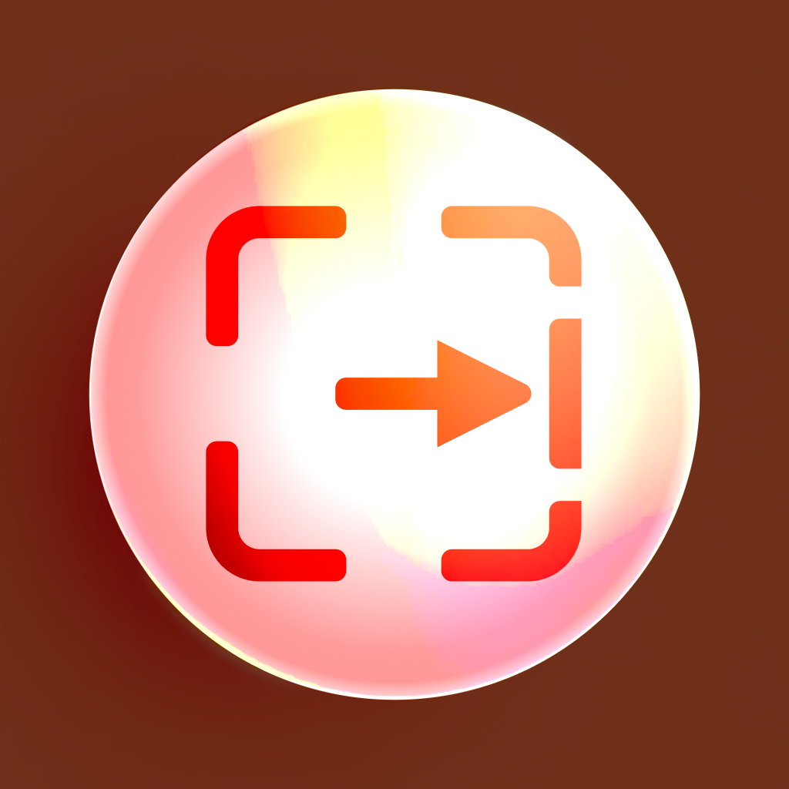

<br>
# Bound To Viewport
<i>Bounds the instance to the viewport</i> <br>
### Version 2.0.0.2

[](https://github.com/skymen/boundToViewport_sdkv2/releases/download/skymen_BoundToViewport-2.0.0.2.c3addon/skymen_BoundToViewport-2.0.0.2.c3addon)
<br>
<sub> [See all releases](https://github.com/skymen/boundToViewport_sdkv2/releases) </sub> <br>

---
<b><u>Author:</u></b> skymen <br>
<b>[Construct Addon Page](https://www.construct.net/en/make-games/addons/544/bound-viewport)</b>  <br>
<b>[Documentation](https://www.construct.net/en/make-games/addons/544/bound-viewport/documentation)</b>  <br>
<sub>Made using [CAW](https://marketplace.visualstudio.com/items?itemName=skymen.caw) </sub><br>

## Table of Contents
- [Usage](#usage)
- [Examples Files](#examples-files)
- [Properties](#properties)
- [Actions](#actions)
- [Conditions](#conditions)
- [Expressions](#expressions)
---
## Usage
To build the addon, run the following commands:

```
npm i
npm run build
```

To run the dev server, run

```
npm i
npm run dev
```

## Examples Files
| Description | Download |
| --- | --- |
| Simple Implementation | [](https://github.com/skymen/boundToViewport_sdkv2/raw/refs/heads/main/examples/Simple%20Implementation.c3p) |

---
## Properties
| Property Name | Description | Type |
| --- | --- | --- |
| Bind Mode | The mode to bind the instance to the viewport | combo |
| Enabled | Enable or disable the behavior | check |


---
## Actions
| Action | Description | Params
| --- | --- | --- |
| Set Enabled | Enable or disable the behavior | Enabled             *(combo)* <br> |
| Set Mode | Set the mode | Mode             *(combo)* <br> |


---
## Conditions
| Condition | Description | Params
| --- | --- | --- |
| Is Enabled | Whether the behavior is enabled |  |


---
## Expressions
| Expression | Description | Return Type | Params
| --- | --- | --- | --- |
